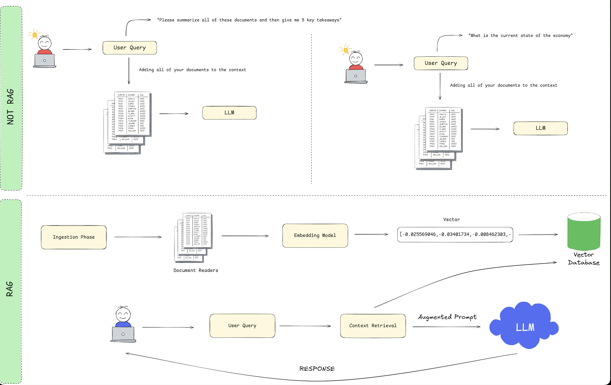
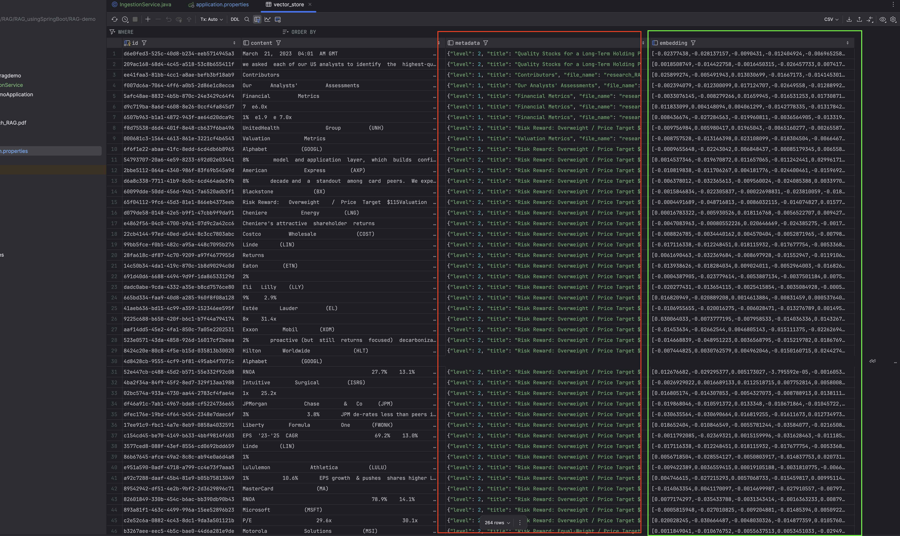

# RAG_usingSpringBoot

Dependencies :

OpenAI as LLM
```aiignore
    <dependency>
        <groupId>org.springframework.ai</groupId>
        <artifactId>spring-ai-openai-spring-boot-starter</artifactId>
    </dependency>
```
PGVector to store data into vector database
```aiignore
    <dependency>
      <groupId>org.springframework.ai</groupId>
      <artifactId>spring-ai-pgvector-store-spring-boot-starter</artifactId>
    </dependency>
```
PDF Document reader to read pdf docs
```aiignore
    <dependency>
      <groupId>org.springframework.ai</groupId>
      <artifactId>spring-ai-pdf-document-reader</artifactId>
    </dependency>
```
Docker Componse Support for Docker 
```aiignore
    <dependency>
      <groupId>org.springframework.boot</groupId>
      <artifactId>spring-boot-docker-compose</artifactId>
      <scope>runtime</scope>
      <optional>true</optional>
    </dependency>
```
RAG Work flow


